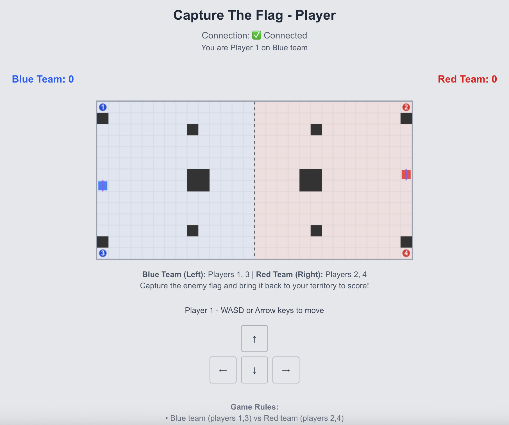
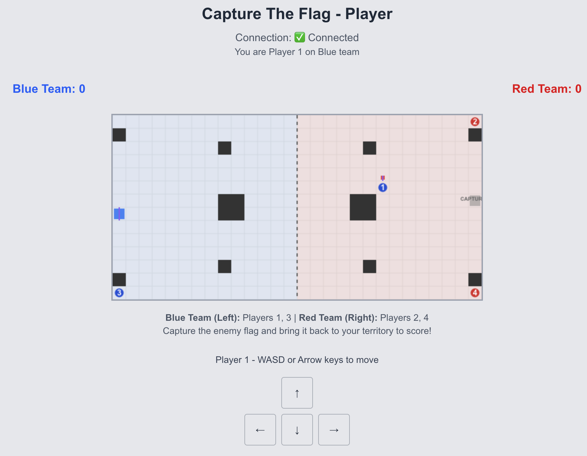
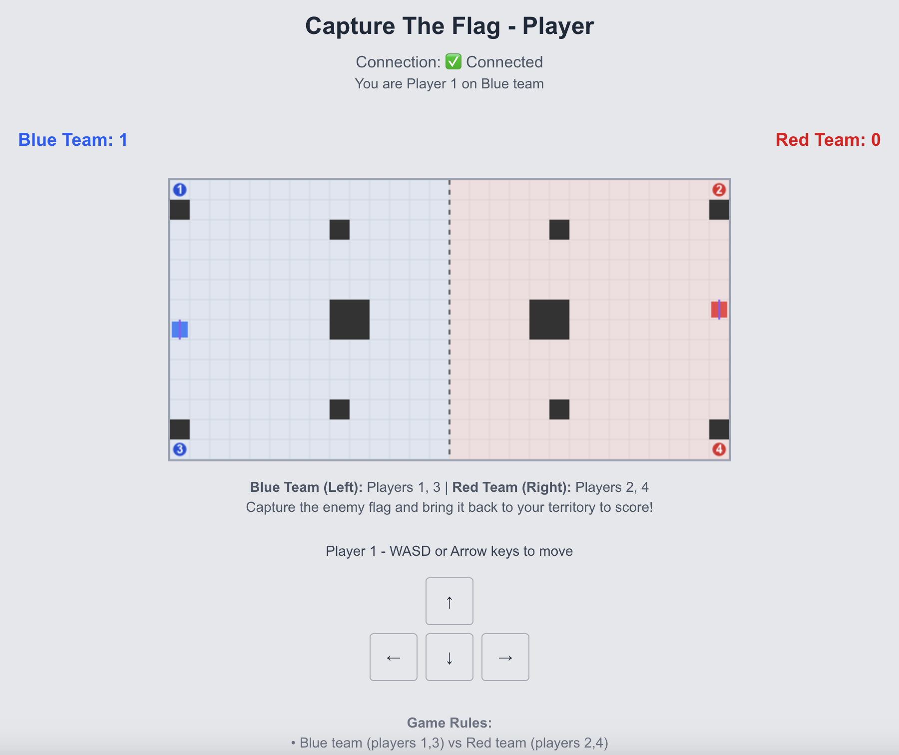

# Capture The Flag Game - Local Setup

A real-time multiplayer Capture The Flag game built with Rust (backend) and Next.js (frontend), featuring WebSocket communication and live game synchronization.

## Features

- **Real-time multiplayer gameplay** - Up to 4 players simultaneously
- **Team-based strategy** - Blue vs Red team competition
- **Live game synchronization** - All players see the same game state in real-time
- **Host/Player system** - One host manages the game, players join with room codes
- **Responsive controls** - Keyboard controls + touch/click buttons for mobile
- **Visual game canvas** - Clean 2D grid-based gameplay with team territories
- **Score tracking** - Real-time score updates for both teams

## Prerequisites

- **Rust** (latest stable version)
- **Node.js** (v18 or higher)
- **npm** or yarn

## Quick Start

### 1. Start the Backend (Rust Server)

```bash
cd backend
cargo run
```

The server will start on `http://localhost:8000`

You should see:

```
listening on 0.0.0.0:8000
```

### 2. Start the Frontend (Next.js)

In a new terminal:

```bash
cd frontend
npm install
npm run dev
```

The frontend will start on `http://localhost:3000`

### 3. Playing the Game

#### Host Setup:

1. Go to `http://localhost:3000`
2. Click **"New game"**
3. Share the **6-digit room code** with players
4. Click **"Start Game"** when players have joined

#### Player Setup:

1. Go to `http://localhost:3000`
2. Click **"Join game"**
3. Enter your name and the **6-digit room code**
4. Wait for host to start the game

#### Direct URL Access:

- **Host**: `http://localhost:3000/host/{ROOM_CODE}`
- **Player**: `http://localhost:3000/play/{ROOM_CODE}`

## Game Controls

### Keyboard Controls:

- **All Players**: WASD keys or Arrow keys
- **Player 3** (additional): F/G/H/T keys
- **Player 4** (additional): J/K/L/I keys

### Touch/Mobile Controls:

- On-screen directional buttons available for all players

## Game Rules

### Teams:

- **Blue Team**: Players 1 & 3 (left side)
- **Red Team**: Players 2 & 4 (right side)

### Objective:

1. **Capture** the enemy team's flag
2. **Return** it to your team's territory to score
3. **First team to score wins the round**

### Gameplay Mechanics:

- Players move on a 28x14 grid with walls as obstacles
- Players caught in enemy territory are **reset to spawn**
- Flags are **carried by players** when captured
- **Scoring** happens when a flag carrier reaches their home territory
- All players **reset to spawn** after each score

### Visual Elements:

- **Blue territory** (left half) with light blue background
- **Red territory** (right half) with light red background
- **Walls** shown as dark blocks
- **Flags** displayed as colored squares at spawn points
- **Players** shown as numbered circles with team colors

## Technical Architecture

### Backend (Rust):

- **Axum** web framework with WebSocket support
- **Real-time game loop** running at 5 FPS (200ms intervals)
- **Room-based multiplayer** with unique 6-digit codes
- **Collision detection** and game physics
- **CORS enabled** for frontend communication

### Frontend (Next.js):

- **React** with TypeScript
- **WebSocket client** for real-time communication
- **HTML5 Canvas** for game rendering
- **Zustand** for state management
- **Tailwind CSS** for styling

### Communication:

- **WebSocket messages** for real-time game updates
- **JSON protocol** for game events (moves, positions, scores)
- **Automatic reconnection** handling

## Development

### Backend Development:

```bash
cd backend
cargo run                    # Run server
cargo test                   # Run tests
cargo run --example interactive_game  # CLI game test
```

### Frontend Development:

```bash
cd frontend
npm run dev                  # Development server
npm run build               # Production build
npm run lint                # Code linting
```

## Troubleshooting

### Connection Issues:

- Ensure backend is running on port **8000**
- Ensure frontend is running on port **3000**
- Check browser console for WebSocket errors
- Verify CORS settings if using different ports

### Game Not Starting:

- Host must click **"Start Game"** button
- At least **1 player** must be connected
- Check WebSocket connection status

### Controls Not Working:

- Ensure game has **started** (not in waiting state)
- Click on game area to **focus** the window
- Try both keyboard and on-screen controls
- Check browser console for JavaScript errors

### Performance Issues:

- Game runs at **5 FPS** by design for smooth multiplayer sync
- Close other browser tabs if experiencing lag
- Check network connection for WebSocket stability

## Room Management

- **Room codes** are 6-digit numbers (000000-999999)
- **Automatic cleanup** of disconnected players
- **Host disconnection** notifies all players
- **Graceful shutdown** handling with Ctrl+C

## Future Enhancements

Potential features for future development:

- Multiple game modes (time limits, multiple rounds)
- Spectator mode
- Game replay system
- Enhanced graphics and animations
- Sound effects and music
- Tournament bracket system
- Player statistics and leaderboards

---

## Visual Preview

### Player Experience

**Game Start - All Players at Spawn**

_Players positioned at their spawn points with flags visible at each team's base_

**Mid-Game Action - Flag Capture in Progress**

_Player 1 (Blue team) has captured the Red flag and is carrying it back to score_

**Score! - Blue Team Scores**

_Blue team successfully scores! All players reset to spawn positions for the next round_

### Key Visual Elements

- **Team Territories**: Blue (left) and Red (right) with colored backgrounds
- **Players**: Numbered circles (1-4) with team colors
- **Flags**: Colored squares at team bases, with "CAPTURED" indicator when taken
- **Flag Carriers**: Small flag icon appears above players carrying flags
- **Walls**: Dark obstacles that block movement
- **Real-time Scores**: Live score tracking at the top
- **Touch Controls**: On-screen directional buttons for mobile play

---

**Enjoy playing Capture The Flag!** 🚩
